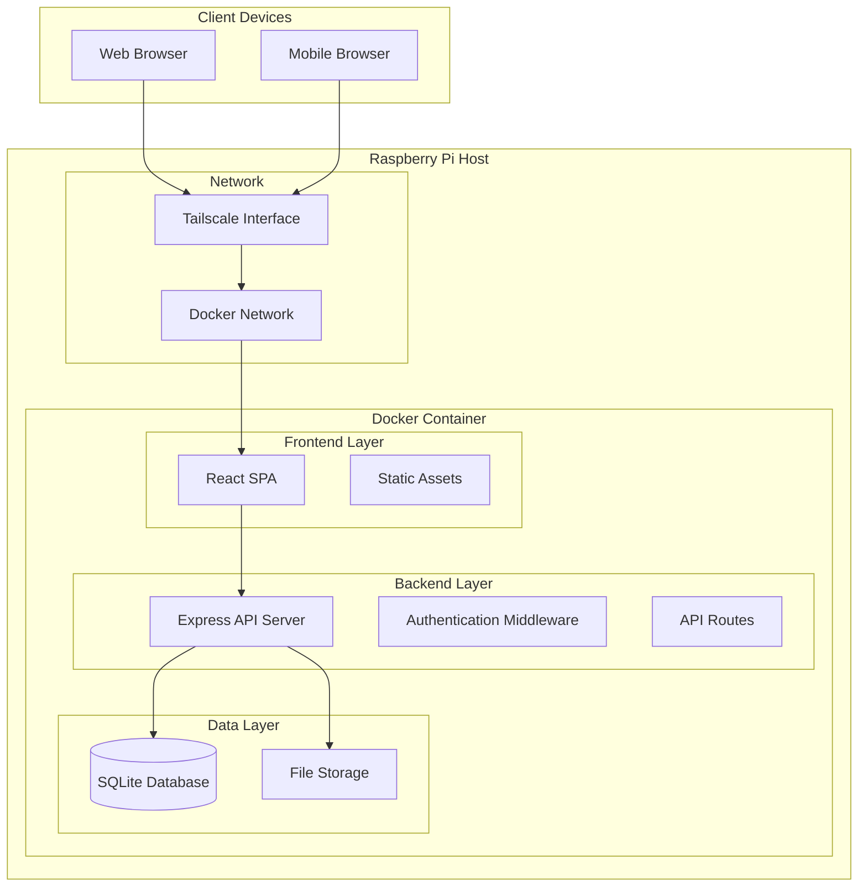

# Design Document

## Overview

The Personal Reading Tracker is a self-hosted web application built with a modern tech stack optimized for Raspberry Pi deployment. The application follows a clean architecture pattern with a React frontend, Node.js/Express backend, and SQLite database for simplicity and reliability. The system is designed to be lightweight, responsive, and easily maintainable while providing a rich user experience for tracking reading progress and managing book highlights.

## Architecture

### System Architecture



### Technology Stack

- **Frontend**: React 18 with TypeScript, Tailwind CSS for styling
- **Backend**: Node.js with Express.js, TypeScript
- **Database**: SQLite with better-sqlite3 for performance
- **Containerization**: Docker with multi-stage build
- **Build Tools**: Vite for frontend, tsx for backend development
- **State Management**: React Context API with useReducer for complex state

## User Interface Design

### Dashboard Layout

The main dashboard is organized into three distinct sections based on reading status:

#### Currently Reading Section
- Displays books with `status: 'in_progress'`
- Shows progress bars and current page information
- Quick actions for updating progress and adding highlights
- Prominent placement at the top of the dashboard

#### Up Next Section
- Displays books with `status: 'not_started'` ordered by position
- Drag-and-drop functionality for reordering reading queue
- Shows book covers, titles, and authors in a clean grid layout
- "Start Reading" button to move books to "Currently Reading"

#### Previously Read Section
- Displays books with `status: 'completed'`
- Shows completion dates, ratings, and highlight counts
- Collapsible section to save space when not needed
- Search functionality specifically for completed books

### Kindle Import Workflow

Based on the actual Kindle highlights format analysis:

#### Import Process
1. **File Upload**: Simple drag-and-drop or file picker for `.txt` files
2. **Parsing Preview**: Shows detected books with title and author extraction
3. **Categorization Interface**: For each detected book, user can:
   - Mark as "Currently Reading"
   - Add to "Up Next" queue with position
   - Mark as "Previously Read"
   - Skip import (for books not in reading list)
4. **Highlight Processing**: Imports all highlights with proper book association

#### Format Handling
- **Title/Author Parsing**: Handles format "Title: Subtitle, Author Name"
- **Highlight Separation**: Uses empty lines as highlight delimiters
- **Duplicate Detection**: Prevents re-importing existing highlights
- **Error Handling**: Graceful handling of malformed entries

### Search and Discovery

#### Global Search
- Search across book titles, authors, and highlight text
- Filter by reading status (Currently Reading, Up Next, Previously Read)
- Advanced search with date ranges and rating filters

#### Highlight Management
- Full-text search within individual books
- Tag system for organizing highlights by themes
- Export functionality for highlights (markdown, PDF)
- Personal notes attached to highlights

## Components and Interfaces

### Frontend Components

#### Core Components
- `App`: Main application wrapper with routing and global state
- `Dashboard`: Main reading list view with organized sections (Currently Reading, Up Next, Previously Read)
- `BookCard`: Individual book display component with progress indicator and status
- `BookDetail`: Comprehensive book information and highlights page
- `HighlightManager`: Component for adding, editing, and organizing highlights
- `ProgressTracker`: Visual progress indicators and update controls
- `SearchBar`: Global search functionality across books and highlights
- `ImportManager`: Kindle highlights import functionality with book categorization
- `ReadingQueue`: "Up Next" section management with drag-and-drop reordering

#### UI Components
- `Layout`: Common layout wrapper with navigation
- `LoadingSpinner`: Consistent loading states
- `Modal`: Reusable modal for forms and confirmations
- `ProgressBar`: Visual progress representation
- `Button`, `Input`, `TextArea`: Styled form components

### Backend API Structure

#### Core Routes
- `GET /api/books` - Retrieve all books with progress, organized by status
- `GET /api/books/:id` - Get detailed book information
- `PUT /api/books/:id/progress` - Update reading progress
- `PUT /api/books/:id/status` - Update book status (not_started, in_progress, completed)
- `PUT /api/books/reorder` - Update reading queue order for "Up Next" books
- `POST /api/books/:id/highlights` - Add new highlight
- `GET /api/books/:id/highlights` - Get all highlights for a book
- `PUT /api/highlights/:id` - Update existing highlight
- `DELETE /api/highlights/:id` - Delete highlight
- `POST /api/import/kindle` - Import Kindle highlights with book categorization
- `GET /api/search` - Search across books and highlights

#### Middleware
- Request logging and error handling
- Input validation and sanitization
- Rate limiting for API protection
- CORS configuration for frontend access

## Data Models

### Database Schema

#### Books Table
```sql
CREATE TABLE books (
    id INTEGER PRIMARY KEY AUTOINCREMENT,
    title TEXT NOT NULL,
    authors TEXT NOT NULL, -- JSON array of author names
    position INTEGER NOT NULL, -- Position in reading order
    status TEXT DEFAULT 'not_started', -- not_started, in_progress, completed
    progress_percentage INTEGER DEFAULT 0,
    total_pages INTEGER,
    current_page INTEGER DEFAULT 0,
    started_date TEXT, -- ISO date string
    completed_date TEXT, -- ISO date string
    personal_rating INTEGER, -- 1-5 stars
    personal_review TEXT,
    cover_image_url TEXT,
    created_at TEXT DEFAULT CURRENT_TIMESTAMP,
    updated_at TEXT DEFAULT CURRENT_TIMESTAMP
);
```

#### Highlights Table
```sql
CREATE TABLE highlights (
    id INTEGER PRIMARY KEY AUTOINCREMENT,
    book_id INTEGER NOT NULL,
    quote_text TEXT NOT NULL,
    page_number INTEGER,
    location TEXT, -- Kindle location or chapter reference
    personal_notes TEXT,
    highlight_date TEXT, -- When originally highlighted
    created_at TEXT DEFAULT CURRENT_TIMESTAMP,
    updated_at TEXT DEFAULT CURRENT_TIMESTAMP,
    FOREIGN KEY (book_id) REFERENCES books (id) ON DELETE CASCADE
);
```

#### Reading Sessions Table (for detailed tracking)
```sql
CREATE TABLE reading_sessions (
    id INTEGER PRIMARY KEY AUTOINCREMENT,
    book_id INTEGER NOT NULL,
    start_time TEXT NOT NULL,
    end_time TEXT,
    pages_read INTEGER DEFAULT 0,
    notes TEXT,
    created_at TEXT DEFAULT CURRENT_TIMESTAMP,
    FOREIGN KEY (book_id) REFERENCES books (id) ON DELETE CASCADE
);
```

### TypeScript Interfaces

```typescript
interface Book {
    id: number;
    title: string;
    authors: string[];
    position: number;
    status: 'not_started' | 'in_progress' | 'completed';
    progressPercentage: number;
    totalPages?: number;
    currentPage: number;
    startedDate?: string;
    completedDate?: string;
    personalRating?: number;
    personalReview?: string;
    coverImageUrl?: string;
    createdAt: string;
    updatedAt: string;
}

interface Highlight {
    id: number;
    bookId: number;
    quoteText: string;
    pageNumber?: number;
    location?: string;
    personalNotes?: string;
    highlightDate?: string;
    createdAt: string;
    updatedAt: string;
}

interface ReadingSession {
    id: number;
    bookId: number;
    startTime: string;
    endTime?: string;
    pagesRead: number;
    notes?: string;
    createdAt: string;
}
```

## Error Handling

### Frontend Error Handling
- Global error boundary to catch React component errors
- API error handling with user-friendly messages
- Network error detection and retry mechanisms
- Form validation with clear error messaging
- Graceful degradation for offline scenarios

### Backend Error Handling
- Centralized error handling middleware
- Structured error responses with consistent format
- Database error handling and transaction rollbacks
- Input validation errors with detailed field information
- Logging of errors for debugging and monitoring

### Error Response Format
```typescript
interface ErrorResponse {
    error: {
        message: string;
        code: string;
        details?: any;
        timestamp: string;
    };
}
```

## Testing Strategy

### Frontend Testing
- **Unit Tests**: Jest and React Testing Library for component testing
- **Integration Tests**: Testing component interactions and API integration
- **E2E Tests**: Playwright for critical user journeys
- **Visual Regression**: Screenshot testing for UI consistency

### Backend Testing
- **Unit Tests**: Jest for individual function and middleware testing
- **Integration Tests**: Supertest for API endpoint testing
- **Database Tests**: In-memory SQLite for isolated database testing
- **Contract Tests**: Ensuring API contracts match frontend expectations

### Test Coverage Goals
- Minimum 80% code coverage for critical paths
- 100% coverage for data manipulation functions
- All API endpoints covered by integration tests
- Key user flows covered by E2E tests

### Docker and Deployment Testing
- Multi-stage Docker build testing
- Container health checks and startup validation
- Network connectivity testing within Docker environment
- Volume persistence testing for database and file storage

## Deployment Architecture

### Docker Configuration
- Multi-stage build: Build stage and production stage
- Node.js Alpine base image for minimal footprint
- Health checks for container monitoring
- Volume mounts for database persistence
- Environment variable configuration

### Raspberry Pi Optimization
- ARM64 compatible base images
- Memory usage optimization for limited RAM
- SQLite configuration tuned for SD card storage
- Efficient static file serving
- Process management for graceful shutdowns

### Network Configuration
- Tailscale integration for secure remote access
- Internal Docker networking for service communication
- Port mapping for web application access
- SSL/TLS termination considerations for production use